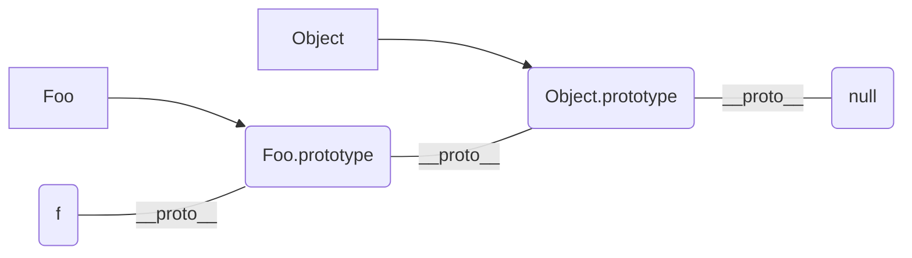

#### js中typeof嫩得到哪些类型
#### 何时使用 === 何时使用 ==
#### js中有哪些内置函数
#### js变量按照存储方式区分有哪些类型，并描述其特点
#### 如何理解JSON

- 值类型
- 引用类型

```
typeof undefined // undefined
typeof 'abc' // string
typeof 123 // number
typeof true // boolean
typeof {} // object
typeof [] // object
typeof null // object, u know, it's a bug
typeof console.log // function
```

typeof只能区分值类型，不能区分引用类型。但是！！！它能区分出函数和object。(69类型)

## 强制类型转换
什么时候肯能发生？
- 字符串拼接的时候
- ==运算符的时候
```
console.log(10 && 0)     // 0
console.log('' || 'abc') // 'abc'
console.log(!window.abc) // true
```
- if 语句的时候
- 逻辑运算的时候
```
100 == '100' // true
0 == '' // true
null == undefined // true
```

#### 何时使用 === 何时使用 ==

```
// From jquery source code
if(obj.a == null){
  // 这里相当于 obj.a === null || obj.a === undefined

}
```

其他情况都建议使用 `===`


#### js中有哪些内置函数(69类型)
Object, Array, Boolean, Number, String, Function, Date, RegExp, Error


#### 如何理解JSON
JSON 现在是js中的一个对象，当然也是一种数据格式

```
typeof JSON // "object"
```

# 原型和原型链
#### 如何判断一个变量是数组类型
#### 写一个原型链继承的例子
#### 描述new一个对象的过程
#### zepto（或其他）源码中如何使用原型链

```
function Foo(name, age){
    this.name = name
    this.age = age
    this.class = 'class-1'
    // return this // 默认有这一行，缺省
}
var f = new Foo('zhangsan', 20);
```

- var a = {} 是 var a = new Object() 的语法糖
- var a = [] 是 var a = new Array() 的语法糖
- function Foo(){} 是var Foo = new Function() 的语法糖
- instanceof 判断一个函数是否是一个变量的构造函数

原型规则
- 所有引用类型（数组，对象，函数），都具有对象特性，即可自由扩展属性（null除外）
- 所有引用类型（数组，对象，函数），都有一个`__proto__`（隐式原型）属性，属性值是一个普通对象
- 所有的函数，都有一个prototype（显式原型）属性，属性值也是一个普通对象
- 所有引用类型（数组，对象，函数），`__proto__`属性指向它的构造函数的prototype属性
- 当试图得到一个对象的属性的时候，如果这个对象本身没有这个属性，那么会去它的__proto__(其构造函数的prototype)中去寻找

```
var obj = {}
obj.__proto__ === Object.prototype
```

```
	// Declare the constructor
	function Foo(name, age) {
		this.name = name
		this.printEngName = function () {
			console.log(this.name)
		}
		// return this // 默认有这一行，缺省
	}

	Foo.prototype.alertName = function () {
		console.log(this.name)
	}


	// Start to use
	var f = new Foo('zhangSan')
	f.printName = function () {
		console.log(this.name) // "this" also will be pointing to object itself
	}

	f.alertName() // Invoke the shared method
	f.printName() // Invoke post extended method
	f.printEngName() // Invoke the initial contruction method
	console.log(f.toString())
```

`hasOwnProperty()` is used to judge if a object has a property regardless the __proto__

instanceof 用于判断“引用类型”属于哪个“构造函数”的方法
instanceof 会顺着__proto__一层层往上找，因此任何对象 f instanceof Object都是true



#### 如何判断一个变量是数组类型
arr instanceof Array

#### #### 描述new一个对象的过程
- 创建一个对象
- this指向这个新对象
- 执行代码，即对this赋值
- 返回this


#### 写一个原型链继承的例子

```
	function Elem(id) {
		this.elem = document.getElementById(id)
	}

	Elem.prototype.html = function (val) {
		var elem = this.elem
		if (val) {
			elem.innerHTML = val
			return this // 链式操作
		} else {
			return elem.innerHTML
		}
	}

	Elem.prototype.on = function (type, fn) {
		var elem = this.elem
		elem.addEventListener(type, fn)
		return this // 链式操作
	}


	// To use
	var div1 = new Elem('bar')
	div1.on('click', function () {
		console.log(123);
	})
```

```
	function Animal(){
		this.eat = function(){
			console.log('Animal eat');
		}
	}

	function Dog(){
		this.eat = function(){
			console.log('Dog eat');
		}
	}

	Dog.prototype = new Animal() // !!!
	var dog = new Dog()
```

## by the way

```
Function.__proto__ === Function.prototype // true
Object.prototype.__proto__ // null
```
